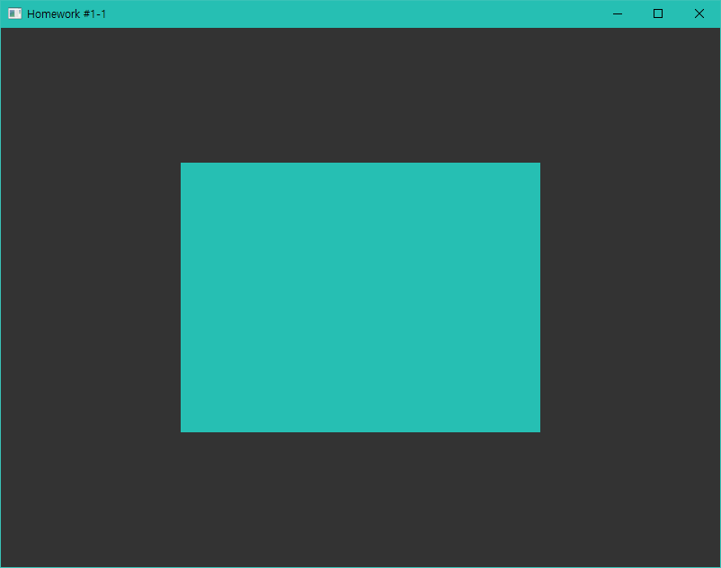
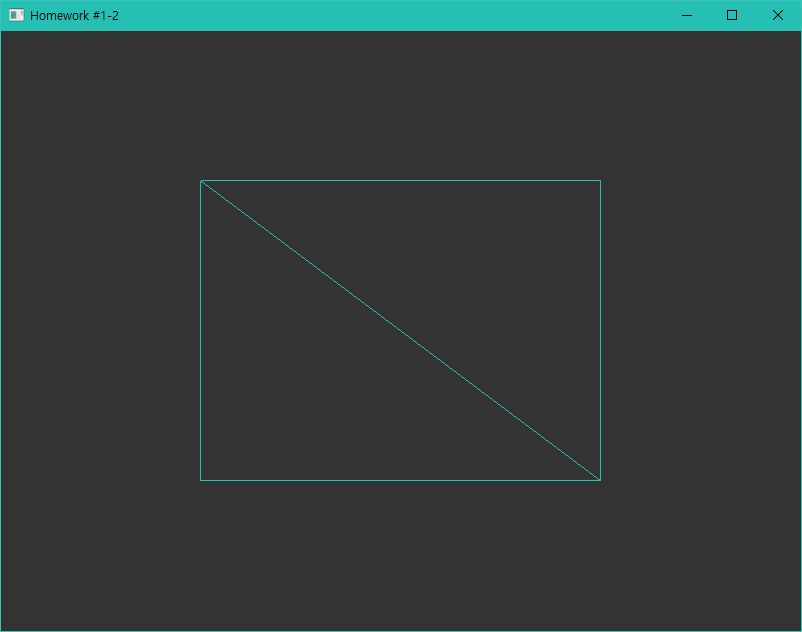
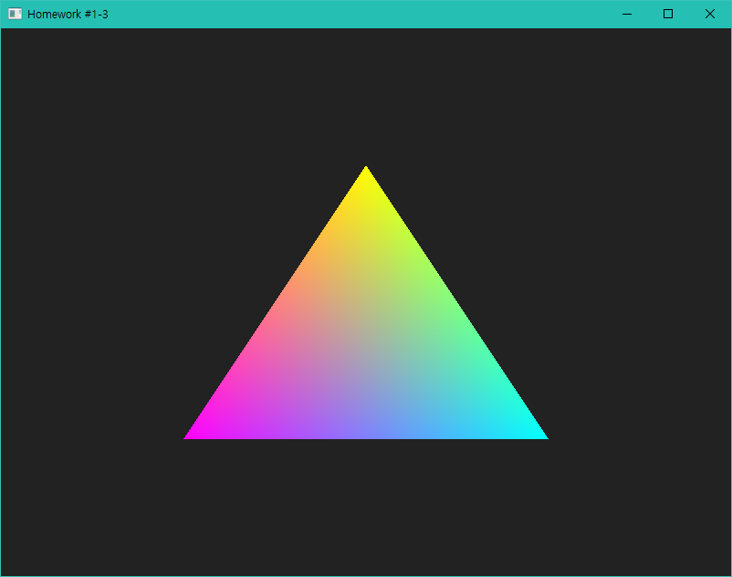

# OpenGL 예제 (1)

## 프로젝트에 사용된 소스코드

- [GLFW](https://www.glfw.org) Windows pre-compiled binaries 3.3.5
- [Glad](https://glad.dav1d.de/)
- [LearnOpenGL](https://github.com/JoeyDeVries/LearnOpenGL)

## 스크린샷

### `01_rectangle`

### `02_triangle_interpolation`

